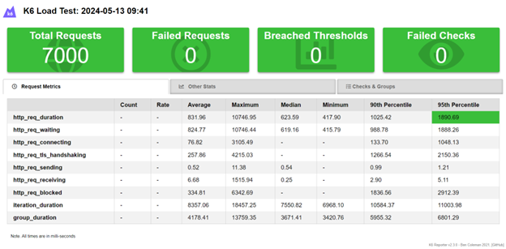
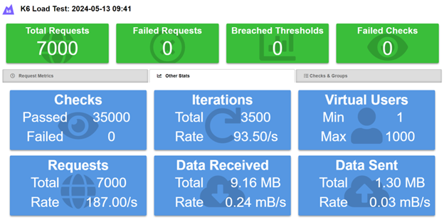
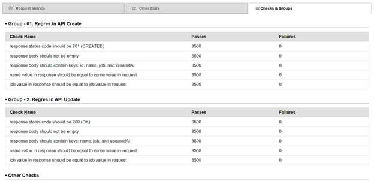
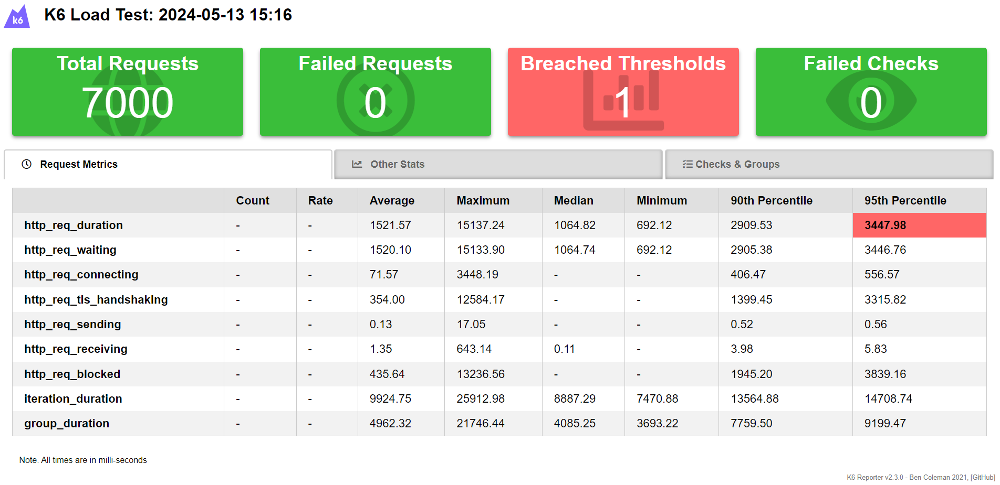
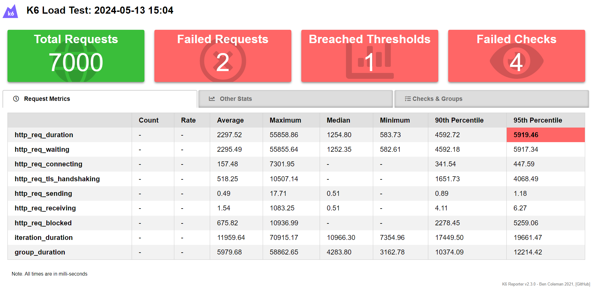
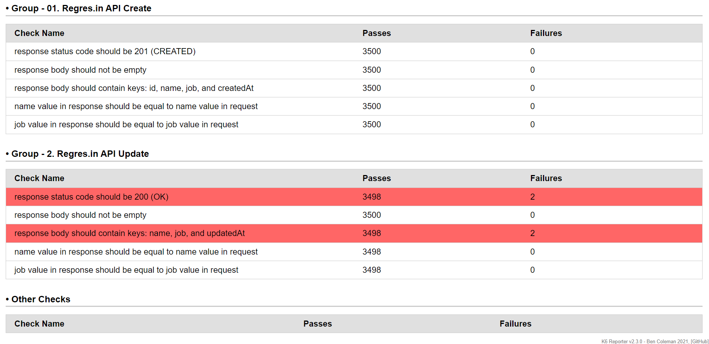

# Final Task

In the final task, we have to solve the challenge using the [K6](https://k6.io/) tools. The API that we used in this task is [Reqres.in](https://reqres.in) and only utilizes two API calls.

To run this task, you need to install the [latest K6 software](https://k6.io/docs/get-started/installation/). Then run the following command:

```bash
k6 run integration_test.js # Run integration test

k6 run performance_test.js # Run performance test
```

## Integration Test

The details of the integration tests can be found in `integration_test.js`. The scenario test for this case is that first we need to call the first API (create) to create a new user. The result of this call is generated post id called `id`. Then, we use this `id` to call the second API (update) to update the existing user.

There are some checks to make sure the integration test is working:

- API Create
  - The response status code should be 201 (CREATED)
  - The response body should not be empty
  - The response body should contain keys: `id`, `name`, `job`, and `createdAt`
  - The `name` value in response should be equal to `name` value in request, and
  - The `job` value in response should be equal to `job` value in request
- API Update
  - The response status code should be 200 (OK)
  - The response body should not be empty
  - The response body should contain keys: `name`, `job`, and `updatedAt`
  - The `name` value in response should be equal to `name` value in request, and
  - The `job` value in response should be equal to `job` value in request

## Performance Test

The details of the performance tests can be found in `performance_test.js`. The scenario test for this case is that the extension of the integration tests by adding some additional features in K6, such as options (vus, iterations, tresholds) and summary of the performance but using [`k6-reporter` made by `Ben Coleman`](https://github.com/benc-uk/k6-reporter).

The result for this test can be found in this repository (`performance_test_result-<timestamp>.html`). And here is the result of the performance.







